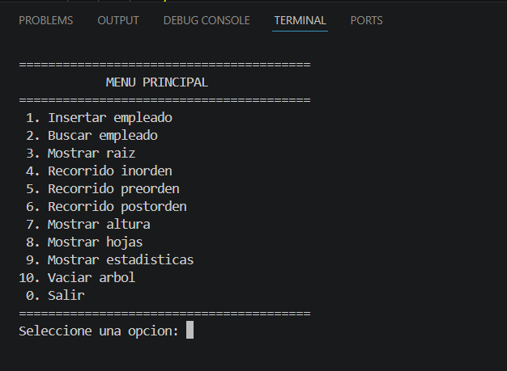
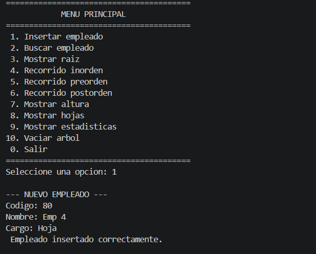
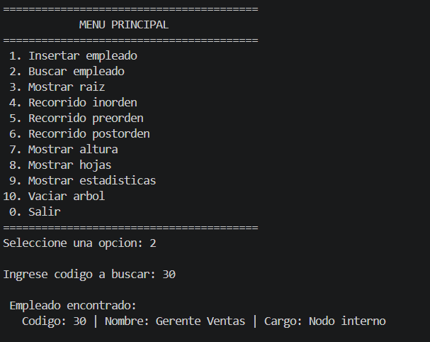
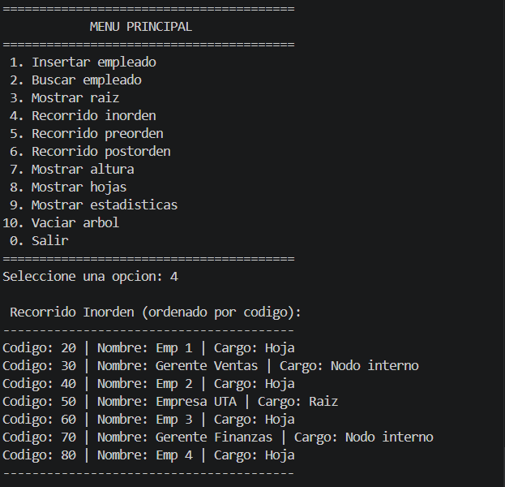
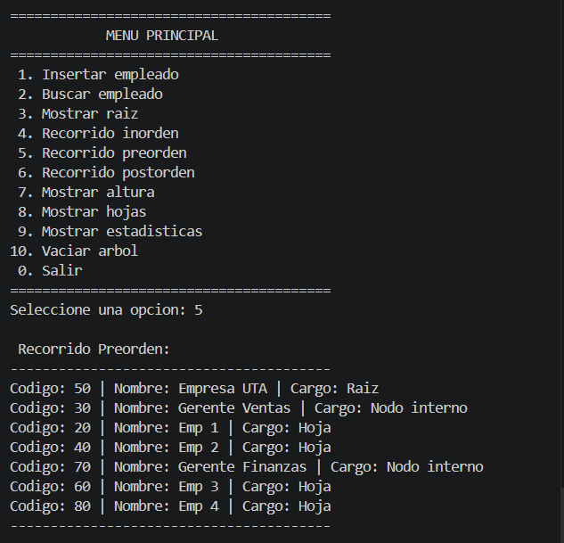
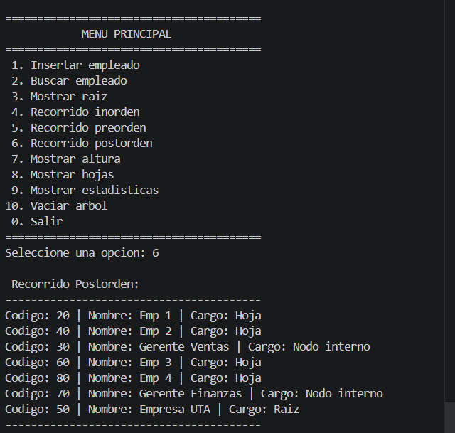
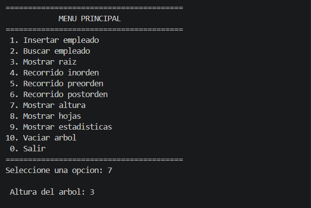
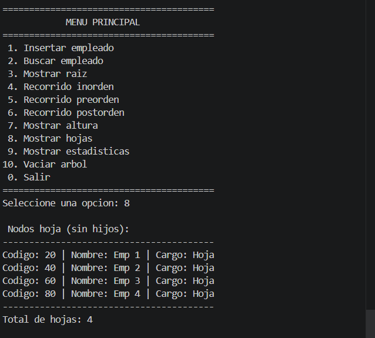
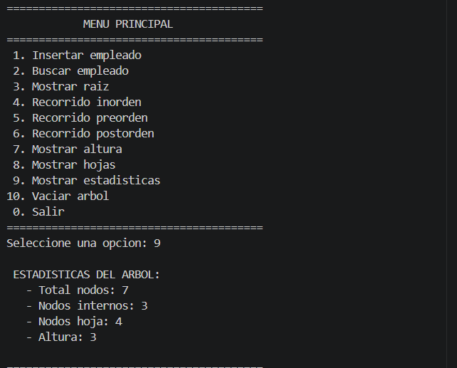

# Arbol BST Empresarial en C++
## Nombre: Medina Chico Darlyn Monserrath
## Asignatura: Estructura de Datos
## Objetivo
Implementar un Arbol Binario de Busqueda (BST) en C++ para organizar empleados de una empresa utilizando el codigo numerico como clave de busqueda.
## Objetivos Especificos
1. Implementar un Arbol Binario de Busqueda (BST) en C++ con operaciones de insercion y busqueda de empleados
2. Desarrollar los recorridos del arbol (inorden, preorden y postorden) para visualizar la estructura jerarquica
3. Calcular la altura del arbol e identificar los nodos hoja aplicando conceptos de recursion y punteros
## Estructura del Proyecto
```
arbol-bst-empresa-cpp/
│
├── src/
│   ├── main.cpp           # Menu principal y entrada del programa
│   ├── Empleado.h         # Declaracion de la clase Empleado
│   ├── Empleado.cpp       # Implementacion de Empleado
│   ├── Nodo.h             # Declaracion de la clase Nodo
│   ├── Nodo.cpp           # Implementacion de Nodo
│   ├── ArbolBST.h         # Declaracion del arbol BST
│   └── ArbolBST.cpp       # Implementacion del arbol BST
│
├── capturas/              # Capturas de pantalla de ejecucion
│   ├── menu.png
│   ├── insercion.png
│   ├── busqueda.png
│   ├── recorridos.png
│   └── altura_hojas.png
│
└── README.md              # Documentacion del proyecto
```
## Funcionalidades
- Insertar empleados
- Buscar empleados
- Mostrar raiz
- Recorridos inorden, preorden y postorden
- Calcular altura
- Mostrar nodos hoja
- Mostrar estadísticas
- Vaciar árbol
## Capturas
### Menu principal

### Insercion de empleados

### Busqueda

### Inorden

### Preorden

### Postorden

### Altura

### Hojas

### Estadisticas


## Conceptos teoricos (Raiz, nodo interno, hoja, nivel, altura)

| Concepto | Definicion | Ejemplo en el arbol |
|----------|------------|---------------------|
| Raiz | Nodo superior del arbol, no tiene padre | Codigo 50 |
| Nodo interno | Tiene al menos un hijo | Codigos 30 y 70 |
| Hoja | No tiene hijos (izquierdo y derecho son nullptr) | Codigos 20, 40, 60, 80 |
| Nivel | Distancia desde la raiz (raiz nivel 0) | Nivel 0: 50, Nivel 1: 30 y 70, Nivel 2: 20,40,60,80 |
| Altura | Numero maximo de niveles desde la raiz hasta la hoja mas lejana | Altura = 2 |

## Datos de Prueba

| Codigo | Nombre | Cargo | Tipo de Nodo |
|--------|--------|-------|---------------|
| 50 | Empresa UTA | Raiz | Raiz |
| 30 | Gerente Ventas | Nodo interno | Interno |
| 70 | Gerente Finanzas | Nodo interno | Interno |
| 20 | Emp 1 | Hoja | Hoja |
| 40 | Emp 2 | Hoja | Hoja |
| 60 | Emp 3 | Hoja | Hoja |
| 80 | Emp 4 | Hoja | Hoja |

## Conclusion
El arbol binario de busqueda permite organizar informacion jerarquica y realizar busquedas eficientes. En promedio, las operaciones de insercion y busqueda tienen complejidad O(log n). Este trabajo permitio comprender la implementacion de estructuras de datos no lineales en C++.
# Como ejecutar
### Requisitos previos
- Tener instalado un compilador de C++ (g++ en Linux/macOS o MinGW en Windows)
- Tener Git instalado (opcional, para clonar el repositorio)

### Paso 1: Clonar o descargar el repositorio
**Opcion A - Clonar con Git:**
bash
git clone https://github.com/Monse1806/arbol-bst-empresa-cpp.git
cd arbol-bst-empresa-cpp

**Opcion B - Descargar manual:**
1. Ve a https://github.com/Monse1806/arbol-bst-empresa-cpp.git
2. Haz clic en el boton verde "Code"
3. Selecciona "Download ZIP"
4. Extrae el archivo ZIP
5. Abre la terminal en la carpeta extraida

### Paso 2: Entrar a la carpeta src
bash
cd src
### Paso 3: Compilar el programa
**En Linux / macOS:**
bash
g++ *.cpp -o arbol
**En Windows (CMD):**
bash
g++ *.cpp -o arbol.exe
### Paso 4: Ejecutar el programa
**En Linux / macOS:**
bash
./arbol
**En Windows (CMD):**
bash
arbol.exe
## Conclusion
El arbol binario de busqueda permite organizar informacion jerarquica y realizar busquedas eficientes. En promedio, las operaciones de insercion y busqueda tienen complejidad O(log n). Este trabajo permitio comprender la implementacion de estructuras de datos no lineales en C++, el uso de punteros, recursividad y la importancia del control de versiones con Git y GitHub.

## Repositorio
https://github.com/Monse1806/arbol-bst-empresa-cpp.git
